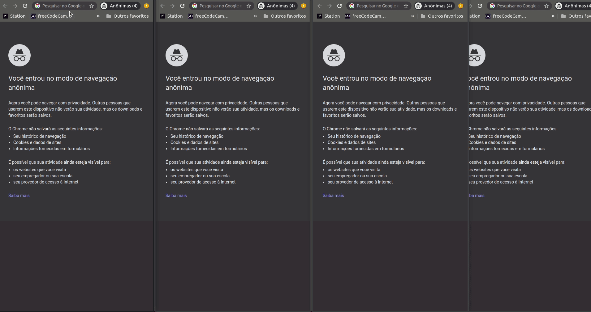

# Online Tic Tac Toe

Its an online Tic Tac Toe game using knowledge learned in node using typescript, SOLID principles and [socket.io](https://github.com/socketio/socket.io)

Follow the same rules of tic tac toe where only two players play the game, if more people enter the session they will be placed on the waiting list as guest without being able to perform actions, in case any of the two main players (X or O) leave the session the first from the guest list will take his place.




## Installation

Clone this repository using git clone

```bash
git clone https://github.com/lucasATeixeira/online-tic-tac-toe.git
```

Install the dependencies using yarn and run the server using yarn dev:server

```bash
yarn
yarn dev:server
```

After starting the server open the browser localhost:3000


## Improvements and Roadmap

- [ ] Paint the winning line
- [ ] Creating rooms for more people to play
- [ ] Link invitation to room

## Contributing
Pull requests are welcome. For major changes, please open an issue first to discuss what you would like to change.

